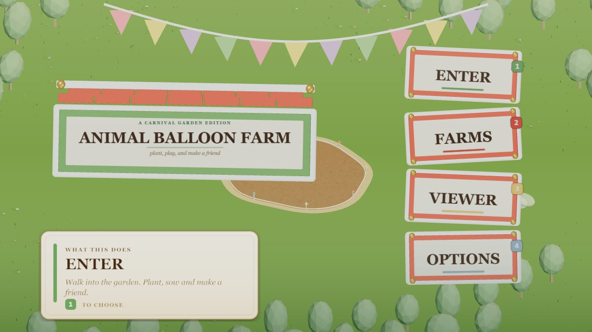
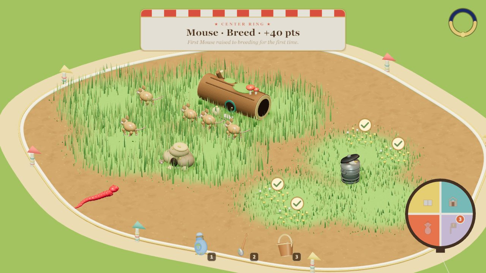
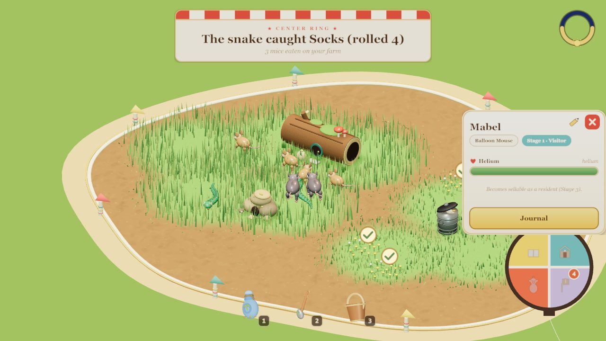
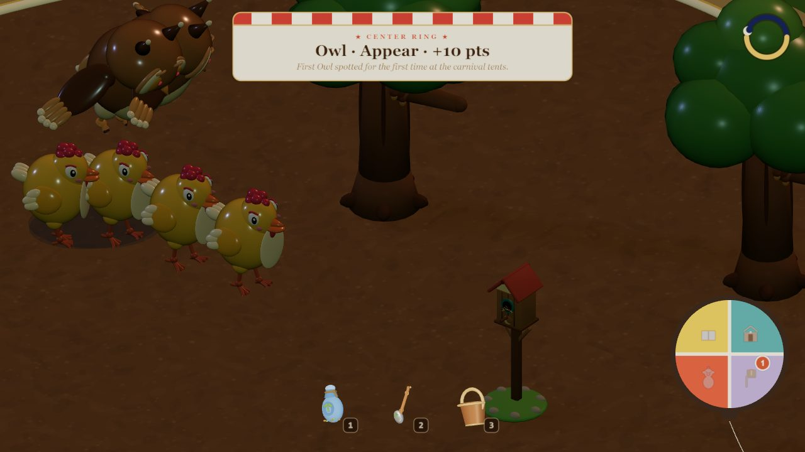
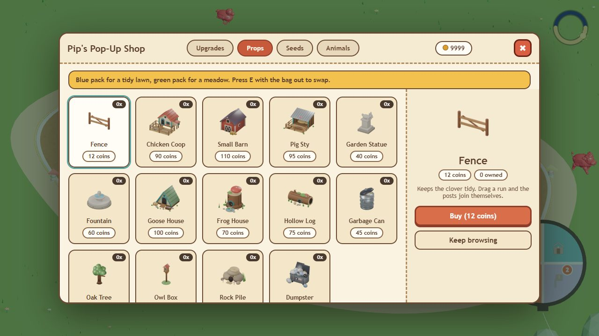

<div align="center">

# 🎈 Animal Balloon Farm

**Grow a garden. Lure in balloon animals. Keep them away from the owl.**

A cozy 3D garden sim that runs in your browser. A travelling carnival sits on
the edge of your farm, and its balloon animals will move in if you build them
the right home.

### [▶ Play it now](https://spencer0.github.io/animal-balloon-farm/)



</div>

---

## The farm



You start with a patch of bare dirt and three tools. Sow lawn and meadow, dig
ponds, plant clover and dandelions, and set out props like hollow logs, rock
piles and coops. Every species wants something different. Mice want tall grass
and somewhere to hide. Frogs want water. Owls want an oak and a supply of
chickens.

## How animals arrive

Each animal climbs four rungs, and you can watch it happen:

1. **Visit the carnival.** A wild animal, still in balloon red, turns up at the tents.
2. **Visit the farm.** It wanders in to look around if your farm has what it wants.
3. **Call the farm home.** Meet its needs and it moves in, then pops into its own colours.
4. **Love the farm.** Give it more and it falls in love (heart eyes) and raises young.



## Night shift



The days run on a clock. After dark, owls hunt chickens, raccoons wake up
beside their bins, and rats come out of the meadow to raid the cans. In the grass, snakes stalk mice
and roll a die for every strike. A good roll pops the mouse. A bad one, and it
bolts for the nearest log.

## Pip's Pop-Up Shop



Sell your plants and animals for coins, then spend them at Pip's: houses,
fences, oaks, owl boxes, seed packs, tool upgrades and land deeds to grow the
farm outward. Your farmer level decides what Pip will sell you.

**12 species so far:** pig 🐷 · sheep 🐑 · cow 🐄 · chicken 🐔 · duck 🦆 ·
goose 🪿 · frog 🐸 · owl 🦉 · raccoon 🦝 · mouse 🐭 · rat 🐀 · snake 🐍

---

## Controls

| Input | Action |
| --- | --- |
| **1** · **2** · **3** | Grass Seeder · Shovel · Water Bucket |
| **Left-drag** | Use the tool: sow, raise soil, pour water |
| **Right-drag** | Tool's other action: dig down, bail water |
| **Middle-drag** | Level the ground (shovel) |
| **E** | Swap seed packs: blue lawn ↔ green meadow (once you've bought it) |
| **Hold Shift** | Put the tool down for a moment to click animals and props |
| **Click** an animal or plant | Open its card. Click the ✏️ to rename it |
| **R** / **Shift+R** | Rotate a prop while placing it |
| **WASD** / **Arrow keys** | Pan the camera (or push the mouse to the screen edge) |
| **Mouse wheel** | Zoom |
| **Left-drag** / **Right-drag** (no tool) | Orbit / pan the camera |
| **Esc** | Cancel placement · close a card · open the menu |

The game autosaves every minute, and you can keep three farms under **Farms**
on the title screen.

---

## Run it locally

```sh
npm install
npm run dev        # http://127.0.0.1:8000/
```

Add `?gardenDebug=1&scenario=meadow/snake-hunt` to the URL to jump straight to
a saved test state. Run `__gardenDebug.scenarios()` in the console for the full
list.

| Command | What it does |
| --- | --- |
| `npm run check` | Tests, asset budgets, typecheck, production build. Run before every push |
| `npm test` | Pure simulation tests (`tests/*.test.mjs`) |
| `npm run deadcode` | Finds unused files, exports and dependencies with [knip](https://knip.dev) |

Every push to `main` deploys to GitHub Pages. `feature/*` branches get their
own preview under `/previews/<branch>/`.

## Built with

[Three.js](https://threejs.org) for everything on screen, TypeScript, and
esbuild. All models are generated by Python scripts run in headless
[Blender](https://www.blender.org). There's no Vite and no framework.

## Docs

| Doc | For |
| --- | --- |
| [docs/DEVELOPMENT.md](docs/DEVELOPMENT.md) | Dev server, debug harness, frame timing, build flags, branch previews |
| [TESTING.md](TESTING.md) | Tests, performance gates, CI |
| [ANIMAL_PIPELINE.md](ANIMAL_PIPELINE.md) | Adding a species, from Blender script to a living animal |
| [PROGRESSION.md](PROGRESSION.md) | Coins, farmer levels, what the shop sells |
| [SCALE_TO_THE_MOON.md](SCALE_TO_THE_MOON.md) | What limits performance, measured |
| [art/blender/README.md](art/blender/README.md) | Blender asset scripts |
| [AGENTS.md](AGENTS.md) | Rules for AI agents working in this repo |

<sub>Screenshots are regenerated by `scripts/readme-shots.mjs` from the dev
scenarios.</sub>
